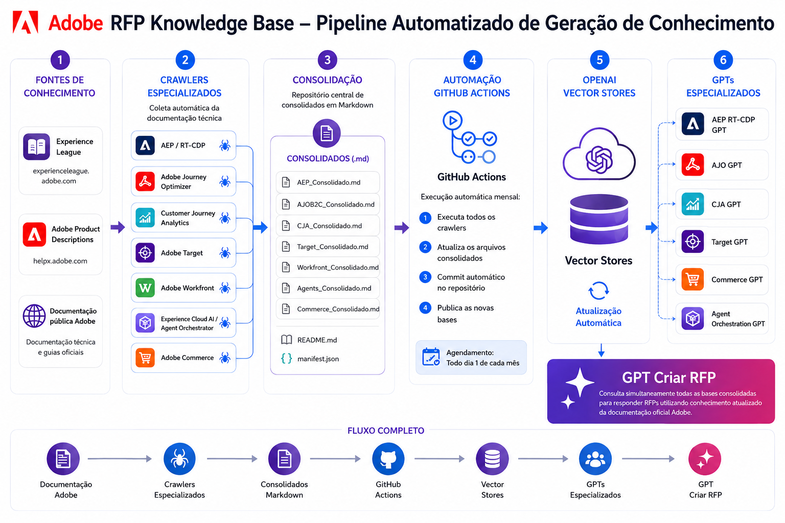

# Adobe RFP Knowledge Base



Base de conhecimento em Markdown gerada automaticamente a partir da documentação pública da Adobe Experience Cloud. Utilizada como fonte de contexto para respostas a RFPs (Request for Proposal).

## Produtos cobertos

| Produto | Crawler | Consolidado | GPT |
|---|---|---|---|
| Adobe Experience Platform + RT-CDP | `AEPRTCDP_crawler.py` | `AEP_Consolidado.md` | [AEP RTCDP](https://chatgpt.com/g/g-6a19c978cb6881919e1d0e04fd03ced3-aep-rtcdp) |
| Adobe Journey Optimizer B2C | `ajo_phase_1_crawler_rfp_flat.py` | `AJOB2C_Consolidado.md` | [AJO](https://chatgpt.com/g/g-69fb53441bfc8191b4241dd6d501a89e-ajo) |
| Adobe Journey Optimizer B2B | `ajob2b_crawler.py` | `AJOB2B_Consolidado.md` | [AJOB2B](https://chatgpt.com/g/g-6a5fbf0fe1c08191be2a274080ba25f9-ajob2b) |
| Customer Journey Analytics | `cja_crawler_v4.py` | `CJA_Consolidado.md` | [CJA](https://chatgpt.com/g/g-6a3aa4aa3b4c819191288504d723319f-cja) |
| Adobe Target | `target_crawler.py` | `Target_Consolidado.md` | [Target](https://chatgpt.com/g/g-6a04c27208e881919cc331cfe90e0828-target) |
| Adobe Workfront | `workfront_crawler_v4.py` | `Workfront_Consolidado.md` | [Workfront](https://chatgpt.com/g/g-6a3ebff01e0881918e9babcfe7457fbf-workfront) |
| Experience Cloud AI / Agent Orchestrator | `experience_cloud_ai_crawler.py` | `Agents_Consolidado.md` | [Agent Orchestration](https://chatgpt.com/g/g-6a26dbb1eed88191b2e0f28514216d6f-agent-orchestration) |
| Adobe Commerce | `commerce_crawler_v1.py` | `Commerce_Consolidado.md` | [Commerce](https://chatgpt.com/g/g-6a453c8d6f388191b9f53006cc7f6fb8-commerce) |
| Adobe Marketo Engage | `marketo_crawler.py` | `Marketo_Consolidado.md` | — |

Cada crawler captura a documentação técnica do [Experience League](https://experienceleague.adobe.com) e as Product Descriptions do [helpx.adobe.com](https://helpx.adobe.com/legal/product-descriptions).

## Automação

O pipeline roda automaticamente via **GitHub Actions** todo dia 1 de cada mês:

1. Executa todos os crawlers
2. Gera os consolidados em `consolidados/`
3. Commita os consolidados no repositório
4. Atualiza as Vector Stores de cada GPT na OpenAI automaticamente

Para disparar manualmente: **Actions → Monthly RFP Knowledge Crawl → Run workflow**

## GPT multi-produto

| GPT | Descrição |
|---|---|
| [Criar RFP](https://chatgpt.com/g/g-6a1f20760130819198d7f524aa4a20a3-criar-rfp) | Acesso a todos os consolidados combinados |

## Estrutura de saída

```
consolidados/
├── AEP_Consolidado.md
├── AJOB2C_Consolidado.md
├── AJOB2B_Consolidado.md
├── CJA_Consolidado.md
├── Target_Consolidado.md
├── Workfront_Consolidado.md
├── Agents_Consolidado.md
├── Commerce_Consolidado.md
├── Marketo_Consolidado.md
├── README.md          # índice combinado
└── manifest.json      # metadados de todas as páginas
```

## Fontes

- [Adobe Experience League](https://experienceleague.adobe.com)
- [Adobe Product Descriptions](https://helpx.adobe.com/legal/product-descriptions)
